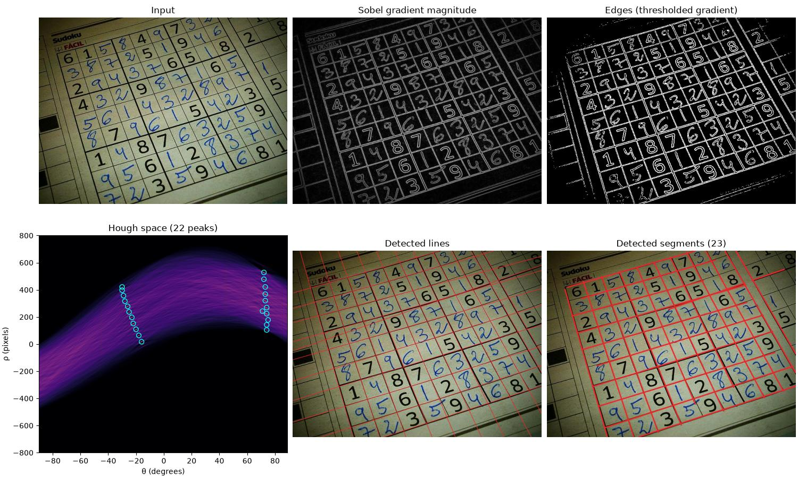
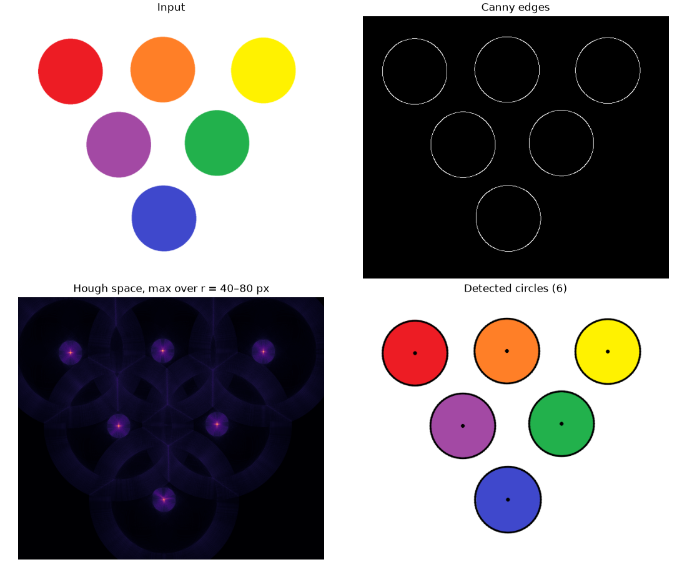

# Hough Transform

A from-scratch implementation of the [Hough Transform](https://en.wikipedia.org/wiki/Hough_transform)
for detecting **line segments** and **circles** in images, written with NumPy. OpenCV is only used
for image I/O, Canny edge detection and drawing; the voting, peak detection and segment
extraction are implemented here.





## How it works

### Lines

1. **Edges.** The grayscale image is convolved with the two 3×3 Sobel kernels, and pixels whose
   gradient magnitude exceeds `--edge-threshold` are kept as edges.
2. **Voting.** Each line is described in normal form, $\rho = x\cos\theta + y\sin\theta$. Every
   edge pixel votes for all the $(\rho, \theta)$ lines passing through it, with
   $\theta \in [-90°, 90°)$ in 1° steps and $\rho$ in 1-pixel steps. A line through *n* edge
   pixels collects *n* votes, so it shows up as a bright peak where many sinusoids intersect.
3. **Peaks.** Local maxima with at least `--min-votes` votes become lines. Only the strongest
   peak is kept within a small $(\rho, \theta)$ window, so the two sides of a thick stroke give
   a single line.
4. **Segments.** The Hough lines are infinite. To find the finite segments, the program walks
   along each line and groups the edge pixels it crosses into runs, bridging gaps of up to
   `--max-gap` pixels. Runs shorter than `--min-length` are dropped.

### Circles

1. **Edges.** Canny edge detection.
2. **Voting.** For every radius *r* in `--min-radius`…`--max-radius`, every edge pixel votes for
   the centers of all the radius-*r* circles passing through it. Votes are divided by the
   circle's perimeter in pixels. Each cell of the $(r, y, x)$ accumulator then holds the
   fraction of that circle that is covered by edges, which makes scores comparable across radii.
3. **Peaks.** For every center, the best radius is kept. Centers scoring at least `--threshold`
   become circles, and centers closer than `--min-distance` pixels are merged.

## Usage

This project uses [uv](https://docs.astral.sh/uv/) and requires Python 3.10+.

```bash
uv sync
uv run hough lines examples/sudoku.jpg
uv run hough circles examples/circles.png
```

Each command prints the detections and opens a figure with every stage of the pipeline. Pass
`-o figure.png` to save the figure instead of opening a window. Run `uv run hough lines --help`
or `uv run hough circles --help` to see the tuning options.

```text
$ uv run hough circles examples/circles.png -o docs/circles.png
circle  center (x, y)  radius  score
     0     (461, 102)      61  0.64
     1     (273, 381)      62  0.61
     2     (271, 101)      61  0.59
     3     (374, 238)      61  0.56
     4      (98, 105)      61  0.54
     5     (188, 242)      61  0.53
```

The detectors can also be used as a library:

```python
import cv2
from hough_transform import detect_circles, detect_lines

gray = cv2.imread("examples/sudoku.jpg", cv2.IMREAD_GRAYSCALE)
for segment in detect_lines(gray).segments:
    print(segment.start, segment.end)
```

## Development

```bash
uv run pytest       # tests on synthetic images with known lines and circles
uv run ruff check . # lint
```

```text
src/hough_transform/
├── lines.py     # Sobel edges, (ρ, θ) voting, line peaks, segment extraction
├── circles.py   # (r, y, x) voting, circle peaks
├── peaks.py     # non-maximum suppression shared by both transforms
├── plotting.py  # pipeline figures
└── cli.py       # `hough` command
```

## Background

This started as an assignment for the Digital Image Processing course of the Graduate Program in
Computer Science (PPGCC) in 2018. It was revamped in 2026. The revamp fixed vote counters that
overflowed at 255 and a Sobel step that discarded negative gradients. The circle detector now
estimates each circle's radius instead of assuming a fixed one. The voting is now vectorized
with NumPy, which takes it from tens of seconds to about a second.
